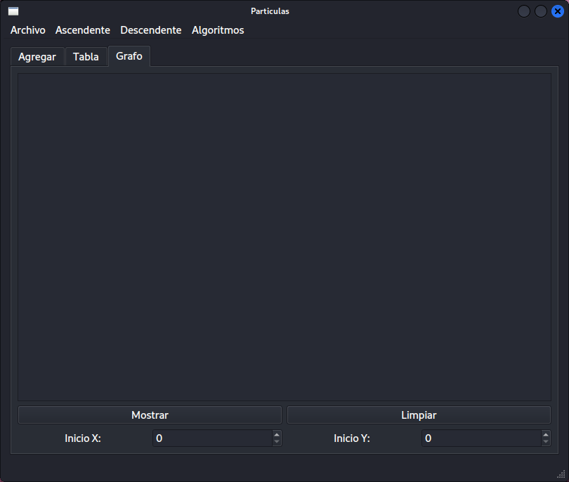

# Main Window

La interfaz se conforma de 3 tabs

## Tab *Agregar*

En el tab ***Agregar*** se ingresa la información de una partícula.

Al presionar el botón ***Agregar al inicio*** o ***Agregar al final*** la partícula se
agrega a un arreglo.

Al presionar ***Mostrar*** se muestra en el ***Plain Text*** la información de cada una
de las partículas del arreglo.

Al presionar ***Mostrar grafo*** se muestran las partículas como un diccionario para
poder ver las conexiones que hay entre cada una.

## Tab *Tabla*

En el tab ***Tabla*** se muestra la información de las partículas en una tabla, esta se
puede limpiar y también se pueden buscar partículas en ella por ***id***.

## Tab *Grafo*

En este último tab, se muestra el inicio, fin, color y distancia de cada partícula de
forma gráfica.

## Menú *Archivo*

En el menú archivo se tienen 3 opciones:

- ***Abrir*** un archivo ***JSON*** para cargar la información de este.
- ***Guardar*** la información actual en un archivo nuevo o en algún archivo existente.
- ***Salir*** de la ventana.

## Menú *Ascendente*

En este menú se tienen las opciones:

- ***Id ascendente:*** Muestra las partículas por *id* de forma *ascendente*, tanto en la
tabla como en el plain text.
- ***Velocidad ascendente:*** Esta opción hace lo mismo que la anterior, pero esta vez
usando la velocidad como parámetro.

## Menú *Descendente*

Este menú solo tiene la opción ***Distancia descendente***, funciona igual que las
opciones anteriores, pero esta ordena las partículas de forma descendente por distancia.

## Menú *Algoritmos*

En este menú hay dos opciones:

- ***Recorrido en profundidad:*** Con esta opción se realiza un algoritmo de recorrido en
profundidad al arreglo de partículas, el recorrido realizado se puede ver en el tab
***Agregar***, el inicio y el final de cada partícula deben estar conectados para que el
algoritmo funcione.

- ***Recorrido en amplitud:*** Con esta opción se realiza un algoritmo de recorrido en
amplitud al arreglo de partículas, el recorrido realizado se muestra en el tab
***Agregar***, al igual que en la otra opción, el inicio y el final de las partículas
deben estar conectados.

# Versión actual - 2022/08/05

## Tab *Agregar*

## Tab *Tabla*

## Tab *Grafo*

